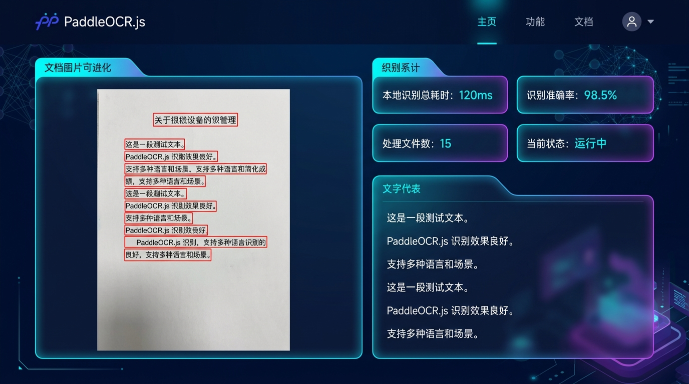

# paddleocr-js-vite-offline-demo

基于百度官方最新的 `@paddleocr/paddleocr-js`（ONNX Runtime Web 驱动）实现的 **100% 纯前端离线 OCR 识别 Demo**。

## 🖥️ 界面预览


---

该项目专为 **零外网依赖、开箱即用、一键分发** 的场景设计。完全解决了 Vite 开发环境下 WASM 胶水代码的 Transform 拦截报错以及浏览器多线程跨域安全限制（COOP/COEP）问题，且**无需物理修改任何 `node_modules` 依赖包**。

---

## 🌟 核心亮点

* **🚀 纯前端离线推理**：支持浏览器端直接解包加载 PP-OCR 模型的 `.tar` 离线推理压缩包，无需部署任何后端识别服务，识别速度极快。
* **🛠️ 优雅的 Vite 开发拦截**：在 [vite.config.ts](vite.config.ts) 中通过自定义开发服务器中间件，拦截并接管对 `public` 目录下 `ort-wasm` 胶水文件的请求。完美规避了 Vite 对 `public` 静态文件的 ESM 转译阻断报错。
* **⚡ 跨域隔离与多线程加速**：配置了多线程 WebAssembly 所必须的 `Cross-Origin-Opener-Policy: same-origin` 和 `Cross-Origin-Embedder-Policy: credentialless` 响应头，直接开启多线程并行加速。
* **📦 零入侵分发**：所有的离线模型资产、中文字体、WASM 运行时文件均存放在 `public/` 目录中。他人只需克隆本仓库、一键 `npm i` 即可在本地完整开发或生产构建。

---

## 📂 项目结构

```text
paddleocr-js-vite-offline-demo/
├── public/                      # 静态资源与离线资产目录
│   ├── models/                  # 官方最新预设离线模型 (.tar 包)
│   │   ├── PP-OCRv5_mobile_det_onnx_infer.tar
│   │   └── ...                  
│   ├── PingFang-SC-Regular.ttf  # Canvas 绘制可视化文本框所用的中文字体
│   ├── ort-wasm-*.js/mjs/wasm   # 离线 ONNX Runtime WebAssembly 运行时及其 Worker 胶水文件
│   └── worker-entry-*.js        # OCR 推理所依赖的 Worker 执行脚本
├── src/
│   └── main.ts                  # OCR 初始化、预测、可视化逻辑主入口
├── index.html                   # 前端演示 UI 页面
├── vite.config.ts               # 包含 onnxruntime 拦截插件的 Vite 配置文件
├── tsconfig.json                # TypeScript 配置文件
└── package.json                 # 依赖声明与启动脚本
```

---

## 🛠️ 快速开始

### 1. 环境准备
确保您的计算机上已安装 [Node.js](https://nodejs.org/)（建议 v18 及以上版本）。

### 2. 克隆与安装依赖
```bash
# 进入项目目录
cd paddleocr-js-vite-offline-demo

# 安装依赖项
npm install
```

### 3. 本地开发调试
启动 Vite 开发服务器：
```bash
npm run dev
```
启动后在浏览器中打开：[http://localhost:5173/](http://localhost:5173/)。

> 💡 **开发环境避坑提示**：
> 当您在本地开发模式下打开页面时，浏览器会自动加载本地 WASM 运行环境。本工程已通过 Vite 拦截插件解决了所有 transform 报错，您无需像其他常规教程一样手动去修改 `node_modules` 下的库文件。

### 4. 生产环境构建与预览
如果您希望将项目打包分发，请运行：
```bash
# 编译并打包
npm run build

# 预览打包后的静态页面
npm run preview
```
打包生成的所有产物均在 `dist/` 目录下，您可以将其直接托管至 Nginx、GitHub Pages 等静态文件服务器（注意：托管环境的服务器响应头需设置 COOP 和 COEP 以支持多线程加速，详情参见 `vite.config.ts`）。

---

## ⚙️ 核心技术配置解析

### 1. 规避 Vite 转译 public 目录下 `.mjs` 报错
由于 `onnxruntime-web` 在运行时会使用动态 `import()` 加载 WASM 胶水代码，Vite 默认会拦截这些网络请求并尝试以模块（Module）方式转译，从而触发：
> *Failed to load url /ort-wasm-simd-threaded.jsep.mjs ... should not be imported from source code.*

在本项目中，我们通过在 `vite.config.ts` 中写入 `onnxruntimeWebPlugin` 中间件进行了拦截：
```typescript
function onnxruntimeWebPlugin() {
  return {
    name: "onnxruntime-web-dev-handler",
    configureServer(server) {
      server.middlewares.use((req, res, next) => {
        const url = req.url ? req.url.split("?")[0] : "";
        // 匹配 WASM 和 JS 胶水文件的加载请求
        if (url.startsWith("/ort") && (url.endsWith(".mjs") || url.endsWith(".wasm"))) {
          const filePath = path.join(__dirname, "public", url.slice(1));
          if (fs.existsSync(filePath)) {
            // 手动设置 Content-Type 并返回，完全绕过 Vite Transform 逻辑
            const ext = path.extname(url);
            const contentType = ext.endsWith(".wasm") ? "application/wasm" : "application/javascript";
            res.setHeader("Content-Type", contentType);
            res.setHeader("Cross-Origin-Opener-Policy", "same-origin");
            res.setHeader("Cross-Origin-Embedder-Policy", "credentialless");
            res.end(fs.readFileSync(filePath));
            return;
          }
        }
        next();
      });
    }
  };
}
```

### 2. 多线程加速
通过在配置中设置 `Cross-Origin-Opener-Policy: same-origin` 和 `Cross-Origin-Embedder-Policy: credentialless` 响应头，浏览器会进入安全隔离环境，解锁 `SharedArrayBuffer` 与多线程推理能力，从而大幅提升本地识别速度。

---

## 📄 开源协议
本项目基于 [Apache 2.0](LICENSE) 协议开源，部分模型权重知识产权归百度 PaddleOCR 团队所有。
